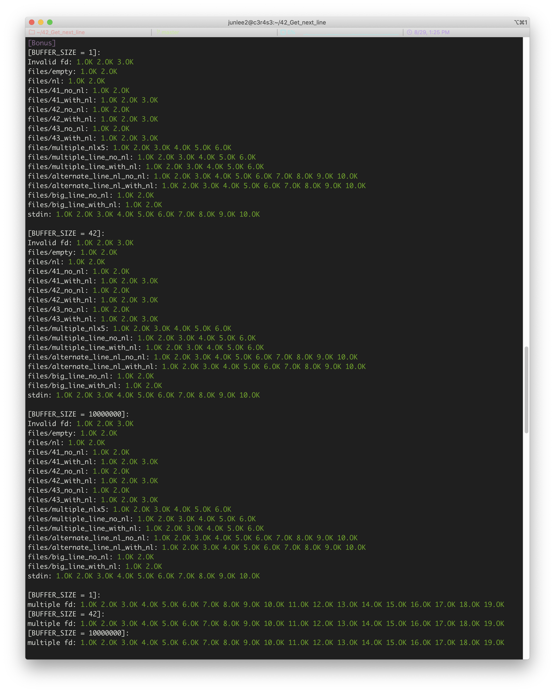

# Get_Next_Line

## GNL 개요

Get Next Line - GNL 은 택스트 파일에서 한줄(\n 또는 EOF을 만나는 부분까지)을 읽어드려서 문자열로 반환하는 함수이다. 

프로토타입은 다음과 같이 선언한다.

```c
char	*get_next_line(int fd)
```

유닉스 기반 시스템에서는 모든 파일들을 fd 파일디스크립터를 활용하여 사용한다. (표준 입출력 포함)

fd의 허용범위는 운영체제와 시스템설정마다 다르며 음수로는 존제할 수 없다.
0은 표준입력, 1은 표준출력, 2는 표준 에러이다. 그 이상는 열리는 파일마다 할당된다.

## GNL을 어떤식으로 구현할 것인가?

### 01. 여러개의 fd가 들어와도 이전 정보를 잃어버리지 않고 기능을 수행할 수 있어야 한다.

1. fd의 최대치는 무었일까? (한 프로그렘에서 열 수 있는 fd)
    1. **System-wide File Descriptors (FD) Limits 가 있다.**
        1. 리눅스의 경우 `/proc/sys/fs/file-max` 에 정의되어 있다.
        2. Hard limit 과 Soft limit 으로 또 나뉘어 있다.
        	- Soft limit 는 새로운 프로그램이 생성되면 디폴트로 적용되는 제한 값이고
        	- Hard limit 는 Soft limit 부터 늘릴 수 있는 최대 값 이다.
        	- Hard limit 는 root 만 조정이 가능하지만 무한히 늘릴 수는 없다.
        
    2. **User Level FD Limits 도 있다.**
        1. 리눅스의 경우 `/etc/security/limits.conf` 에서 수정 할 수 있다.
        2. 마찬가지로 Hard limit 과 Soft limit 으로 또 나뉘어 있다.
2. 여려개의 fd들을 어떠한 방식으로 처리할 것인가?
    1. 배열을 만든다.
        1. list[fd] 식으로 쉽고 빠르게 접근이 가능하다.
        2. 주어진 함수들로 배열의 크기를 정확하게 파악하고 할당하기가 불가능하다.
    2. 연결리스트를 사용한다.
        1. 새로운 fd가 들어올때마다 새로운 노드를 생성하기 때문에, 시스템 설정과 무관하게 구현이 가능하다.
        2. 함수가 호출마다 리스트를 순회하며 노드를 찾아야 한다.

### 02. BUFFER_SIZE 가 정해져 있다.

1. 변화하는 버퍼에 따라 read()함수의 호출 횟수가 달라진다.
    1. 버퍼가 하나이면 정보들을 다 담을수가 없다.
        1. strjoin을 응용한다.
            
            `n`번 read를 호출하면 `(1 + 1) ... (1 + n - 1) * BUFFER_SIZE` 만큼의 데이터 복사가 이루어진다.
            
            또한 `\0` 에 대해서 의도대로 처리하지 못한다. (줄 중간에 `\0` 가 있을 경우)
            
        2. 버퍼도 연결 리스트를 활용한다.
            
            `n`번 read를 호출하면 `n * BUFFER_SIZE` 만큼의 데이터 복사가 이루어진다.
            
            `\0` 에 대해서 의도대로 처리할 수 있다.)
            
            구현 과정에서의 복잡도(모든 리스트들에 대한 malloc과 free)가 있고, 함수 개수의 제한으로 인한 단점이 있다.
            
        3. 재귀를 사용한다.
            
            연결리스트 방식과 매우 유사한 방식이지만, 정적 변수를 활용하여 malloc 과 free의 복잡도를 줄일 수 있다.
            
2. 버퍼에 다음줄의 정보를 가지고 있을 수 있다.
    1. 마지막 버퍼와 이의 마지막 인덱스 정보를 저장한다.

### 03. 연결리스트의 구조

1. 구조체
    
    ```c
    typedef struct s_fdlist
    {
    	int				fd;
    	char			buffer[BUFFER_SIZE];
    	ssize_t			totallen;
    	ssize_t			stack;
    	ssize_t			s_idx;
    	ssize_t			c_idx;
    	ssize_t			status;
    	ssize_t			indent;
    	struct s_fdlist	*next;
    	struct s_fdlist	*prev;
    }	t_fdlist;
    ```
    
2. 작동 순서
    1. 함수 호출시 `find_fd()` 를 통해 전달된 `fd`를 검색한다. `fdhead` 는 정적 `static`변수이다.
        1. 리스트를 찾으면 찾은 리스트를 반환한다.
        2. 검색결과가 없으면 새로 만들어 리스트에 추가하고 반환한다.
    2. 반환된 fd리스트를 이용하여 파일을 읽는다.
        1. `fdlist`가 처음 생성된 것이라면 `read`를 실행한다.
            1. 이후 구조체의 변수들(`totallen`, `stack`, `s_idx`, `c_idx`, `indent`)을 설정한다.
        2. `fdlist` 에 저장된 `index`정보부터 `\n` 또는 `read`가 반환한 값(`BUFFER_SIZE`)까지 읽는다.
            1. `read`의 반환값(`status`)이 `0`이면서 `totallen`이 `0`이면 `NULL`을 반환한다.
                
                `totallen`이 `0`이 아니면 `returnstr`를 만들어 반환한다.
                
                위 2개의 경우 모두 리스트를 `free`한다.
                
            2. `\n`을 찾으면 `returnstr`을 만들고 구조체의 `buffer`를 복사하여 반환한다.
            3. 찾지 못했다면 `read`를 실행하고 재귀을 실행한다.
            4. 재귀가 돌아오면 `returnstr`에 구조체의 `buffer`를 복사하여 반환한다.

## GNL 코드

최근 보컬 간담회의 내용으로 인하여서 로직의 중요부분(**`get_line_re`**)은 생략되어 있습니다.

### get_next_line 함수

```c
char	*get_next_line(int fd)
{
	static t_fdlist	fdhead;
	t_fdlist		*workbench;

	if (fd < 0 || BUFFER_SIZE <= 0)
		return (0);
	fdhead.fd = -1;
	workbench = find_fd(fd, &fdhead);
	if (!workbench)
		return (0);
	return (line_manager(workbench));
}
```

### find_fd 함수

```c
t_fdlist	*find_fd(int fd, t_fdlist *fdlist)
{
	t_fdlist	*fdnode;

	fdnode = fdlist;
	while (fdnode->next != 0)
	{
		if (fdnode->next->fd == fd)
			return (fdnode->next);
		fdnode = fdnode->next;
	}
	fdnode->next = (t_fdlist *)malloc(sizeof(t_fdlist));
	if (!fdnode->next)
		return (0);
	fdnode->next->fd = fd;
	fdnode->next->s_idx = -1;
	fdnode->next->next = 0;
	fdnode->next->prev = fdnode;
	return (fdnode->next);
}
```

### line_manager 함수

```c
char	*line_manager(t_fdlist	*fdlist)
{
	char	*returnstr;

	fdlist->totallen = 0;
	if (fdlist->s_idx == -1)
	{
		fdlist->status = read(fdlist->fd, fdlist->buffer, BUFFER_SIZE);
		if (fdlist->status <= 0)
			return (free_fdlist(fdlist));
		fdlist->s_idx = 0;
	}
	fdlist->indent = fdlist->s_idx;
	fdlist->c_idx = fdlist->s_idx;
	fdlist->stack = 0;
	returnstr = get_line_re(fdlist);
	if (returnstr == 0)
		return (free_fdlist(fdlist));
	if (fdlist->status == 0)
		free_fdlist(fdlist);
	returnstr[fdlist->totallen] = 0;
	return (returnstr);
}
```

### return_buffer 함수

```c
void	return_buffer(t_fdlist buff, char *returnstr, ssize_t max_idx)
{
	ssize_t	idx;
	ssize_t	bsize;

	if (!returnstr)
		return ;
	bsize = BUFFER_SIZE;
	idx = buff.s_idx;
	while (idx < max_idx)
	{
		returnstr[buff.stack * bsize + idx - buff.indent] = buff.buffer[idx];
		idx++;
	}
}
```

### free_fdlist 함수

```c
char	*free_fdlist(t_fdlist *fdlist)
{
	fdlist->prev->next = fdlist->next;
	if (fdlist->next)
		fdlist->next->prev = fdlist->prev;
	free(fdlist);
	return (0);
}
```

### 테스트 결과


